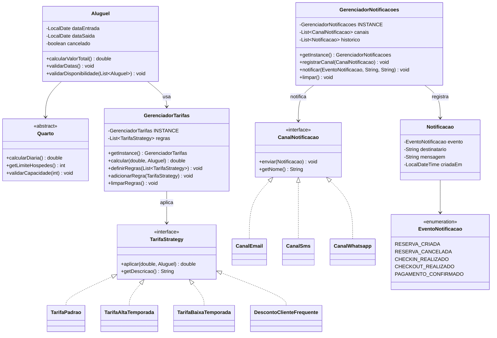

# Sprint 4 - Diagrama UML

```mermaid
classDiagram
    class Aluguel {
        -LocalDate dataEntrada
        -LocalDate dataSaida
        -boolean cancelado
        +calcularValorTotal() double
        +validarDatas() void
        +validarDisponibilidade(List~Aluguel~) void
    }

    class Quarto {
        <<abstract>>
        +calcularDiaria() double
        +getLimiteHospedes() int
        +validarCapacidade(int) void
    }

    class TarifaStrategy {
        <<interface>>
        +aplicar(double, Aluguel) double
        +getDescricao() String
    }

    class TarifaPadrao
    class TarifaAltaTemporada
    class TarifaBaixaTemporada
    class DescontoClienteFrequente

    class GerenciadorTarifas {
        -GerenciadorTarifas INSTANCE
        -List~TarifaStrategy~ regras
        +getInstance() GerenciadorTarifas
        +calcular(double, Aluguel) double
        +definirRegras(List~TarifaStrategy~) void
        +adicionarRegra(TarifaStrategy) void
        +limparRegras() void
    }

    class GerenciadorNotificacoes {
        -GerenciadorNotificacoes INSTANCE
        -List~CanalNotificacao~ canais
        -List~Notificacao~ historico
        +getInstance() GerenciadorNotificacoes
        +registrarCanal(CanalNotificacao) void
        +notificar(EventoNotificacao, String, String) void
        +limpar() void
    }

    class CanalNotificacao {
        <<interface>>
        +enviar(Notificacao) void
        +getNome() String
    }

    class CanalEmail
    class CanalSms
    class CanalWhatsapp

    class Notificacao {
        -EventoNotificacao evento
        -String destinatario
        -String mensagem
        -LocalDateTime criadaEm
    }

    class EventoNotificacao {
        <<enumeration>>
        RESERVA_CRIADA
        RESERVA_CANCELADA
        CHECKIN_REALIZADO
        CHECKOUT_REALIZADO
        PAGAMENTO_CONFIRMADO
    }

    Aluguel --> Quarto
    Aluguel --> GerenciadorTarifas : usa
    GerenciadorTarifas --> TarifaStrategy : aplica
    TarifaStrategy <|.. TarifaPadrao
    TarifaStrategy <|.. TarifaAltaTemporada
    TarifaStrategy <|.. TarifaBaixaTemporada
    TarifaStrategy <|.. DescontoClienteFrequente

    GerenciadorNotificacoes --> CanalNotificacao : notifica
    GerenciadorNotificacoes --> Notificacao : registra
    Notificacao --> EventoNotificacao
    CanalNotificacao <|.. CanalEmail
    CanalNotificacao <|.. CanalSms
    CanalNotificacao <|.. CanalWhatsapp
```
